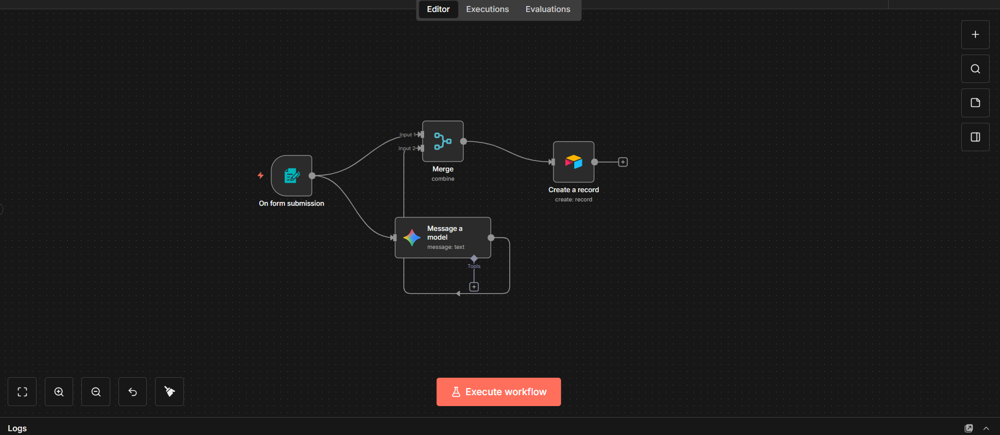
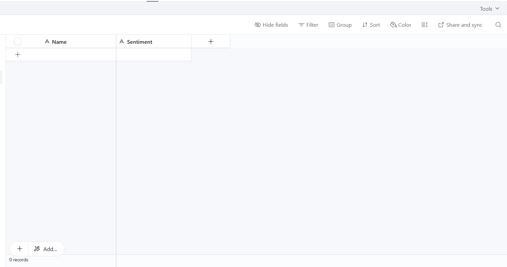
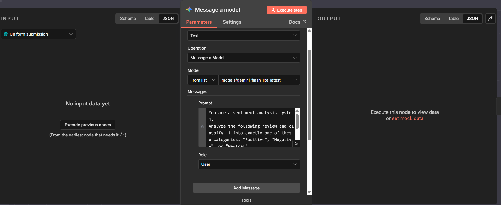
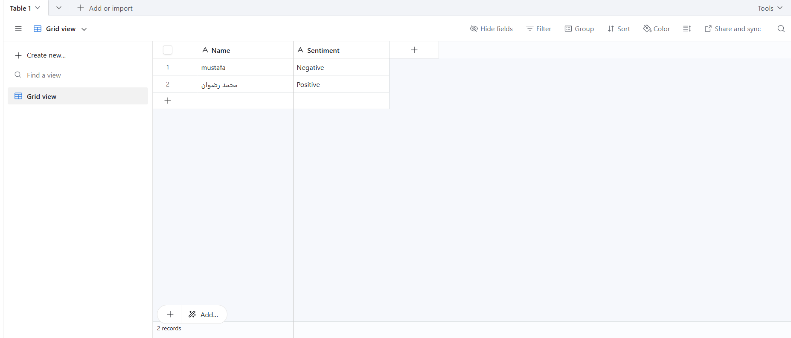

# 🤖 Otomatik Müşteri Duygu Analizi (AI Sentiment Analysis Workflow)

Bu proje, **n8n** platformu kullanılarak oluşturulmuş tam otomatik bir iş akışıdır (Workflow).

Sistem, bir web formu aracılığıyla müşteri yorumlarını alır, **Google Gemini** yapay zekasını kullanarak metnin tonunu anında analiz eder (Pozitif, Negatif veya Nötr olarak sınıflandırır) ve sonucu müşteri adıyla birlikte düzenli bir şekilde **Airtable** veritabanına kaydeder.

## 📸 Projeye Genel Bakış

Aşağıdaki şema, verilerin form gönderiminden depolamaya kadar nasıl aktığını göstermektedir.

*Şekil 1: n8n üzerindeki tam iş akışı şeması.*

---

## ✨ Temel Özellikler

* **Kodsuz Otomasyon (No-Code):** Tamamen n8n görsel arayüzü kullanılarak oluşturulmuştur.
* **Akıllı ve Anlık Analiz:** Metinleri analiz etmek için hızlı ve hassas `gemini-1.5-flash` modeli kullanılır.
* **Bulut Tabanlı Veritabanı:** Sonuçlar, kolay yönetim ve takip için Airtable'da saklanır.
* **Hazır Web Formu:** Müşterilerle paylaşmaya hazır entegre bir veri giriş formu içerir.

---

## 🛠️ Kullanılan Teknolojiler

| Teknoloji / Araç | Amaç |
| :--- | :--- |
| **[n8n](https://n8n.io/)** | Otomasyon ve servisleri birbirine bağlayan ana motor. |
| **[Google AI (Gemini)](https://ai.google.dev/)** | Duygu analizi yapan yapay zeka modeli (LLM). |
| **[Airtable](https://airtable.com/)** | Yorumları ve analiz sonuçlarını saklayan veritabanı. |

---

## 🚀 Kurulum ve Çalıştırma

Bu projeyi kendi n8n kopyanızda çalıştırmak için aşağıdaki adımları izleyin.

### Ön Gereksinimler
1.  Kurulu ve çalışan bir n8n sürümü.
2.  API Anahtarı (API Key) almak için bir Google AI Studio hesabı.
3.  Bir Airtable hesabı.

### Adım 1: İş Akışını İçe Aktarma (Import)
1.  Bu depodaki (repository) `.json` dosyasını indirin.
2.  n8n panelinizde menüye gidin ve **Import From File** seçeneğini seçin.
3.  İndirdiğiniz dosyayı seçin; şema yukarıdaki resimdeki gibi görünecektir.

### Adım 2: Airtable Veritabanını Hazırlama
İş akışını çalıştırmadan önce, verileri alacak tabloyu hazırlamalısınız.
1.  Airtable'da yeni bir "Base" oluşturun.
2.  Aşağıdaki iki temel sütunu (Single line text türünde) ekleyin:
    * **Name** (Müşteri adını saklamak için).
    * **Sentiment** (Analiz sonucunu saklamak için: Positive/Negative).

*Şekil 2: Airtable'da gerekli sütunlar.*

### Adım 3: Kimlik Bilgilerini Ayarlama (Credentials)

İş akışının çalışması için Gemini ve Airtable erişim anahtarlarınızı n8n'e girmeniz gerekir.

**1. Google Gemini Ayarları:**
* Gemini düğümünü (Node) açın.
* Yeni bir Credential oluşturun ve **API Key**'inizi girin.
* Yapay zekanın tek kelimelik cevap vermesi için "Prompt" ayarlarının resimdeki gibi olduğundan emin olun.

**2. Airtable Ayarları:**
* Airtable düğümünü (Node) açın.
* **Personal Access Token** kullanarak yeni bir Credential oluşturun.
* *Önemli Not:* Token oluştururken şu izinleri (Scopes) verdiğinizden emin olun: `data.records:write`, `data.records:read` ve `schema.bases:read`.
* Oluşturduğunuz Base ve Tabloyu seçin.

---

## 🎮 Kullanım

1.  Ayarları tamamladıktan sonra, n8n ekranının sağ üst köşesindeki **Activate** butonuna basarak iş akışını aktif hale getirin.
2.  **On Form Submission** düğmesini açın.
3.  **Production URL** bağlantısını kopyalayın.
4.  Bu bağlantıyı tarayıcıda açın veya müşterilerinizle paylaşın.
5.  Formu doldurup gönderdiğinizde, yorumunuz Airtable tablosunda analiz sonucuyla birlikte anında görünecektir!

*Şekil 3: Sistem çalıştıktan sonra saklanan örnek veriler.*

---
Bu proje, yapay zeka araçlarını otomasyonda kullanmayı öğrenmek amacıyla oluşturulmuştur. Özgürce kullanabilir veya geliştirebilirsiniz!
